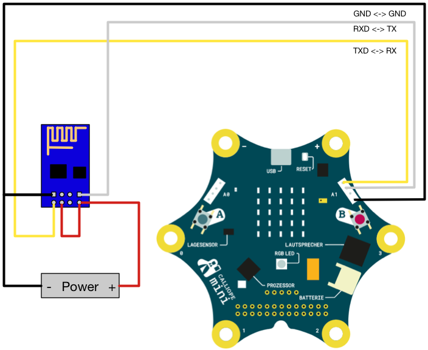

# Code your Life weather service

This is a package for sending weather data to the code your life wether service using the calliope mini with an ESP8622 module.
It can be used by the [PXT Calliope mini editor](https://pxt.calliope.cc/).

> ⚠ To use this package you will need an ESP8266 module and a **Code your Life Weather ID**.
> You can get both from the Intiative [Code your Life](http://www.code-your-life.org/).

> If you are using your own ESP8266 module, note that this requires up to 300mA.
> To provide these, use an external power source for the module or install a capacitor (about 50uF).

## Wiring the module




## Example

### Blocks


### Javascript

```typescript
input.onButtonPressed(Button.A, () => {
    basic.showNumber(3)
    custom.sendData(
        "123456789",
        input.temperature(),
        input.lightLevel(),
        0,
        0
    )
    basic.showNumber(4)
})
basic.showNumber(0)
custom.initWifi()
basic.showNumber(1)
custom.connectWifi("WLAN-SSID", "WLAN-PASSWORT")
basic.showNumber(2)
```

## Meta

- for PXT/calliope

Depends on [pxt-calliope-modem](https://github.com/calliope-mini/pxt-calliope-modem).

Author: Marian Mehling ([@mergey_](https://twitter.com/mergey_))

## License

MIT